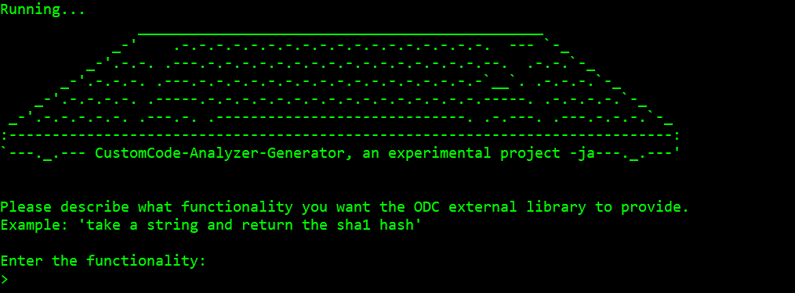
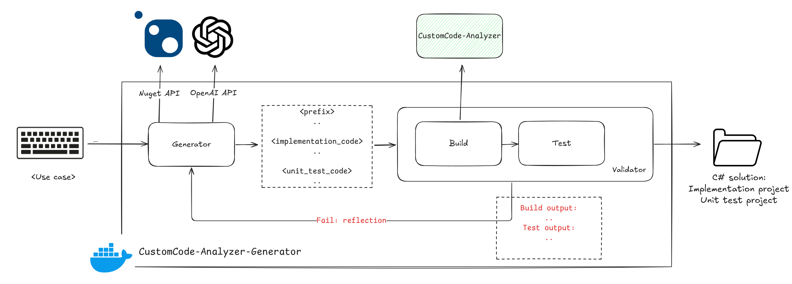
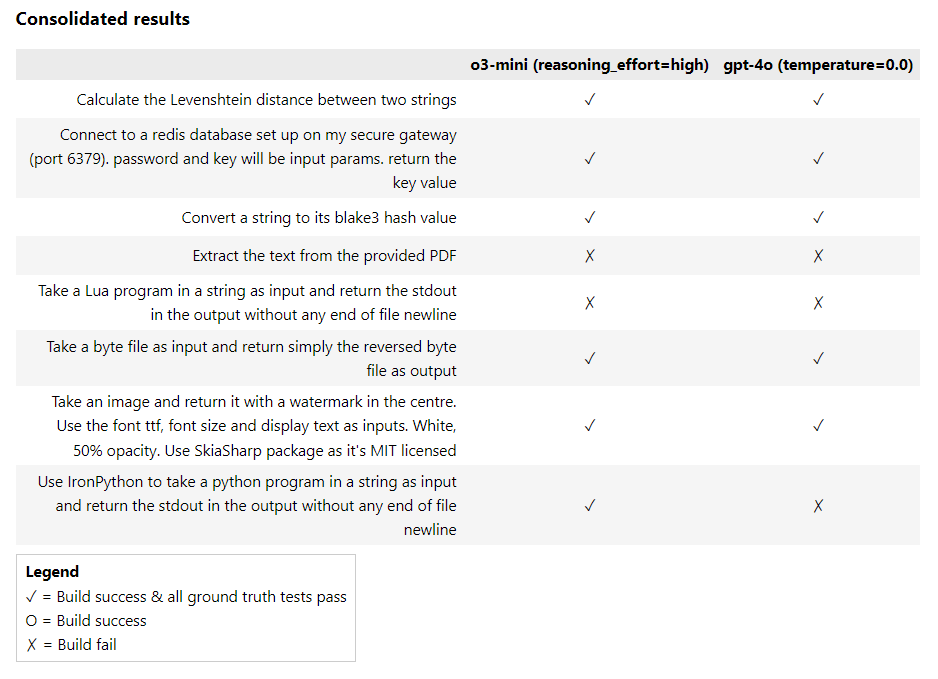

# OutSystems Developer Cloud (ODC) Custom Code Analyzer: Generator

[](https://sonarcloud.io/summary/new_code?id=jonathanalgar_CustomCode-Analyzer-Generator) [](https://makeapullrequest.com)

[](https://sonarcloud.io/summary/new_code?id=jonathanalgar_CustomCode-Analyzer-Generator) [](https://sonarcloud.io/summary/new_code?id=jonathanalgar_CustomCode-Analyzer-Generator)
 [](https://sonarcloud.io/summary/new_code?id=jonathanalgar_CustomCode-Analyzer-Generator)

> :information_source: This component is unofficial and unsupported by OutSystems.



⚡ **`CustomCode-Analyzer-Generator` is a command line tool to generate ODC External Library solutions complete with unit tests**. See examples of generated solutions [here](./README_resources/example_generations/RedisConnector/) (_**>** Connect to a redis database set up on my secure gateway (port 6379). password and key will be input params. return the key value_) and [here](./README_resources/example_generations/PythonRunner/) (_**>** Take a python program in a string as input and return the stdout in the output_). ⚡

## Overview

The BSD-3 licensed [`CustomCode-Analyzer`](https://github.com/jonathanalgar/CustomCode-Analyzer) component was released to give you real-time feedback your C# code as you build an External Library in your IDE of choice. But more generally `CustomCode-Analyzer` can be thought of as a way of locally validating an External Library at the point of build. This makes it a powerful component in an end-to-end Large Language Model (LLM) pipeline for generating an ODC External Library:



The `CustomCode-Analyzer-Generator` is an orchestrator  around the `CustomCode-Analyzer` and other local components and external APIs. As seen in the above diagram the `CustomCode-Analyzer-Generator` takes user input for an External Library functionality and:

* Calls the NuGet API and LLMs to generate the candidate implementation and unit test code.
* Creates implementation and unit test C# projects, installs packages and incorporates candidate code.
* Uses `CustomCode-Analyzer` as part of build to validate implementation code.
* Uses generated unit tests to further validate implementation code.
* Manages a reflection mechanism for self-correction and improvement in case of build failure or unit test failure.

In practice, that looks something like this (no speedup applied on a slow laptop!):


## How to use

> :information_source: For safety, `CustomCode-Analyzer-Generator` runs inside a sandboxed Docker container. Therefore, you must first install [Rancher Desktop](https://rancherdesktop.io/) (recommended) or [Docker Desktop](https://www.docker.com/products/docker-desktop/) to run it.

### Windows

1. Open Windows PowerShell.
1. Run the [quick start script](./windows_setup.ps1):

        irm https://raw.githubusercontent.com/jonathanalgar/CustomCode-Analyzer-Generator/refs/heads/main/windows_setup.ps1 | iex

1. Follow the instructions in the script.

### Mac
_(Quick start script for Mac coming soon)._

1. Open the [`Terminal` app](https://support.apple.com/en-sg/guide/terminal/apd5265185d-f365-44cb-8b09-71a064a42125/mac).
1. Create the required directories in the home directory or elsewhere:

        mkdir -p ~/CustomCode-Analyzer-Generator/generated-solutions && chmod 700 ~/CustomCode-Analyzer-Generator/generated-solutions && cd ~/CustomCode-Analyzer-Generator

1. Create a `.env` file in `~/CustomCode-Analyzer-Generator` and edit with your text editor of choice. Use [`.env_example`](./.env_example) as template.
1. Run the command:

        docker run --pull always -it --rm --env-file .env -v "$(pwd)/generated_solutions:/app/output" ghcr.io/jonathanalgar/customcode-analyzer-generator:latest

1. The generated solution libraries will be created in `~/CustomCode-Analyzer-Generator/generated_solutions`.

##  Technical notes on evaluation

To validate that the LLM pipeline works effectively and generates external libraries aligned with user intent there is a supplementary evaluation pipeline complete with [eight diverse test cases](./agents/evaluation/ground_truth/).

This means a range of models and prompts can be programatically benchmarked. The central piece of pipeline is the Roslyn-based [`CCGATestGenerator`](./agents/evaluation/CCAGTestGenerator/), which—given the LLM-generated implementation code and human created ground truth file—will deterministically create a unit test.

Test cases covered include [binary data](./agents/evaluation/ground_truth/pdf.yml) and [network access through the secure gateway](./agents/evaluation/ground_truth/redis.yml). The test set is currently limited to single action (but with support for multi-parameter using an LLM to do name mapping) and single type output.

Consolidated no-repetition results for 2x OpenAI models with one-shot prompt (current default prompt):



See full runs [here](https://htmlpreview.github.io/?https://github.com/jonathanalgar/CustomCode-Analyzer-Generator/blob/main/benchmark_results/runs.html) or use [this notebook](./agents/evaluation/benchmark_analysis.ipynb).

You can replicate a run using:

```
docker compose -f run_full_benchmark.yml up --abort-on-container-exit
```
_(More documentation and analysis coming soon.)_

## TODO

See [here](https://github.com/jonathanalgar/CustomCode-Analyzer/issues?q=is%3Aopen+is%3Aissue+label%3Aenhancement).

## Feedback and contributions

Please report bugs and feature requests [here](https://github.com/jonathanalgar/CustomCode-Analyzer/issues/new/choose).

PRs are welcome. In particular, code quality improvements, new unit/integration tests, new ground truths, and documentation improvements are all welcome 🤗 All changes to code should pass all existing tests (which are lacking and need to be expanded!). Please format any new code with [Mypy and Flake8 for Python](./Makefile) and [Csharpier for C#](./Makefile).
